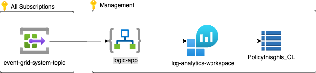

# Azure Policy Insights

When working with Azure Policies and trying to reach a compliant state it is always a challenge to figure out what has changed over a given period of time. The answer to that is [Azure Event Grid](https://learn.microsoft.com/en-us/azure/governance/policy/concepts/event-overview). Azure Event Grid allows you to push Policy State events to subscribers like an Azure Function or a Logic App which you can then use for analytics or create alerts on.

An example of analytics can be found in the [Azure Compliance Workbooks repo](https://github.com/Eurofiber-CloudInfra/azure-compliance-workbooks/) which contains an Azure workbook that visualizes Regulatory Compliance information audited by Azure Regulatory Compliance Policy Initiatives.

This repo contains a sample Bicep deployment of an Event Grid System Topic and a basic Logic App that captures all policy state events and stores it in a Log Analytics workspace.




# Deployment

First deploy the Logic App which would probably life in your Management subscription. Next deploy the Event Grid Topic Subscription to every subscription from which you want to collect policy events.

In this example it is assumed that you already have a Log Analytics workspace deployed.

## Logic App

```bash
subscription="<subscription id>"
resource_group_name="<resource group name>"
logic_app_name="<logic app resource name>"
law_resource_id="<resource id of an existing log analytics workspace>"

az account set -s $subscription

az group create -g $resource_group_name -l westeurope 

az deployment group create  --resource-group $resource_group_name \
                            --template-file bicep/logic-app.bicep \
                            --parameters \
                                logic_app_name=$logic_app_name \
                                law_resource_id=$law_resource_id 

```

After deployment capture the resource id of the Logic App from the deployment output.

## Event Grid System Topic

```bash
subscription="<subscription id>"
resource_group_name="<resource group name>"
event_grid_system_topic_name="<event grid system topic resource name>"
logic_app_resource_id="<captured logic app resource deployment from previous deployment>"

az account set -s $subscription

az group create -g $resource_group_name -l westeurope 

az deployment group create  --resource-group $resource_group_name \
                            --template-file bicep/event-grid-system-topic.bicep \
                            --parameters \
                                event_grid_system_topic_name=$event_grid_system_topic_name \
                                logic_app_resource_id=$logic_app_resource_id 
```